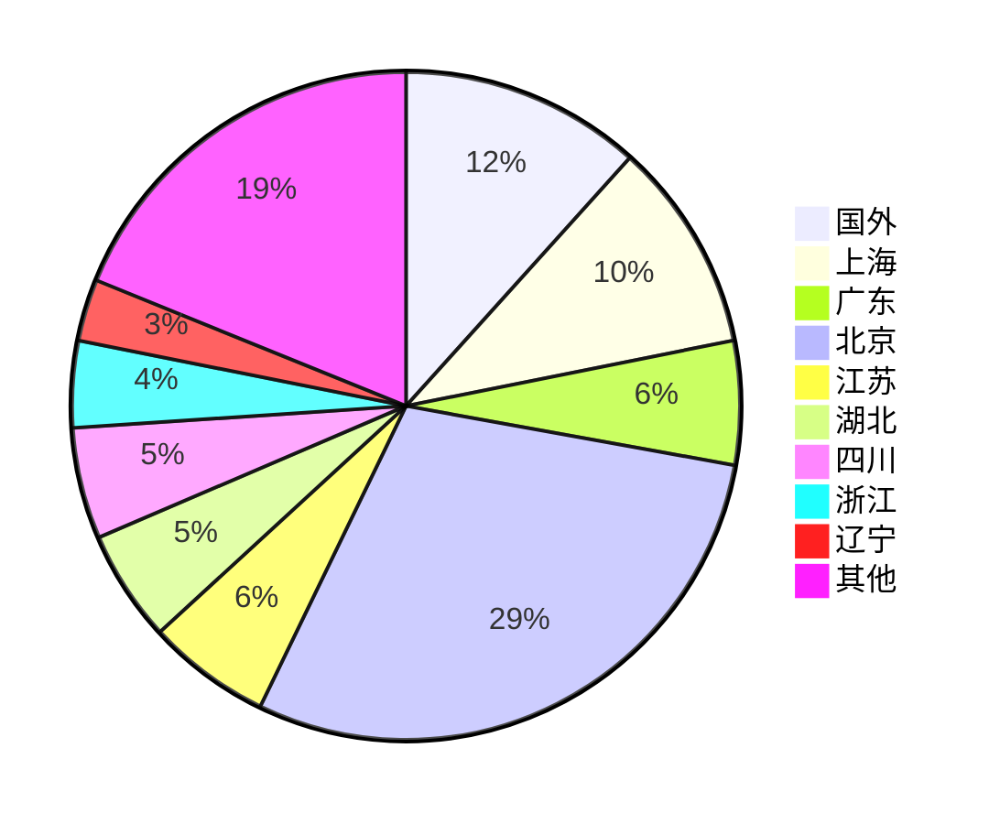

# 2019年度热门电影分析报告

### 一、背景简介

本文广泛获取2019年所有电影的票房数据，并选取2019年度票房过亿前十部电影作为主要展示对象。在豆瓣上获取每部电影的标签信息和评分数据，读取粉丝分布属性。并同时爬取每部电影的400条短评，采用 snownlp 库进行观点情感分析，得出每部电影的正面、负面、中性评价比率。所有相关爬取数据及代码均在 https://github.com/Hyxpillow/SocialComputing_Homework1

### 二、票房属性

在猫眼上，可以找到2019年中国电影票房总榜，从中筛选出2019年上映的，电影票房榜前十部电影，统计如下

| 排名 | 电影名称              | 时间       | 票房（万） | 平均票价 | 场均人数 |
| ---- | --------------------- | ---------- | ---------- | -------- | -------- |
| 1    | 哪吒之魔童降世        | 2019-07-26 | 500340     | 35       | 23       |
| 2    | 流浪地球              | 2019-02-05 | 468111     | 44       | 29       |
| 3    | 复仇者联盟4：终局之战 | 2019-04-24 | 424899     | 48       | 23       |
| 4    | 我和我的祖国          | 2019-09-30 | 312336     | 37       | 35       |
| 5    | 中国机长              | 2019-09-30 | 290354     | 37       | 26       |
| 6    | 疯狂的外星人          | 2019-02-05 | 221177     | 41       | 30       |
| 7    | 飞驰人生              | 2019-02-05 | 172623     | 41       | 25       |
| 8    | 烈火英雄              | 2019-08-01 | 170317     | 35       | 19       |
| 9    | 少年的你              | 2019-10-25 | 155607     | 36       | 16       |
| 10   | 速度与激情：特别行动  | 2019-08-23 | 143424     | 35       | 15       |

其中《哪吒之魔童降世》、《烈火英雄》、《速度与激情》平均票价最少，均为35元。《我和我的祖国》场均人数最多，为35人

由于此处不便展示，2019年在映的296部电影的票房数据均已爬取至 https://github.com/Hyxpillow/SocialComputing_Homework1/blob/master/boxDesc.md

经过统计，票房超过一亿的电影有90部，其中超过十亿的电影有15部。年度票房平均数为21582.4万元，中位数为2393万元

### 三、 正面，负面，中性评价比

参考上述十部电影在豆瓣上获得的评论，每部400条，采用 snownlp 进行观点分析，由于原训练样本与电影评论实际样本存在出入，此处选取正向概率超过97%的作为正面评价，低于90%作为负面评价，此时观察到百分比堆积柱状图与实际情况相符合

每部影片的评论极性比例中，正面均在45%以上，其中《流浪地球》正面评价占有比例最高，接近80%，而《速度与激情：特别行动》得到负面评价占比最高，超过40%

2019年票房排名的前十部电影的前400条豆瓣评论，以及其倾向分析（1表示正面，0表示中性，-1表示负面）均已爬取至 https://github.com/Hyxpillow/SocialComputing_Homework1/tree/master/all_comments

### 四、粉丝分布

以《我和我的祖国》的评价用户（前400位）为例，分析评论粉丝分布，此处作图使用 pyecharts

其中北京的人数最多，为98人，上海的人数第二，为34人

| 地区     | 人数 | 地区         | 人数 | 地区     | 人数 | 地区       | 人数 | 地区           | 人数 |
| -------- | ---- | ------------ | ---- | -------- | ---- | ---------- | ---- | -------------- | ---- |
| 北京     | 98   | 辽宁沈阳     | 5    | 山东济南 | 2    | 四川绵阳   | 1    | 山东菏泽       | 1    |
| 上海     | 34   | 江苏苏州     | 4    | 云南昆明 | 2    | 四川宜宾   | 1    | 内蒙古呼伦贝尔 | 1    |
| 湖北武汉 | 17   | 湖南长沙     | 4    | 浙江台州 | 2    | 山东淄博   | 1    | 四川南充       | 1    |
| 四川成都 | 14   | 山东青岛     | 3    | 宁夏银川 | 1    | 齐齐哈尔   | 1    | 新疆吐鲁番     | 1    |
| 广东广州 | 12   | 中国香港     | 3    | 广西南宁 | 1    | 青海海北   | 1    | 江西南昌       | 1    |
| 浙江杭州 | 9    | 安徽合肥     | 3    | 吉林白山 | 1    | 浙江金华   | 1    | 吉林吉林       | 1    |
| 天津     | 7    | 福建厦门     | 3    | 江苏淮安 | 1    | 四川巴中   | 1    | 河南洛阳       | 1    |
| 广东深圳 | 7    | 河北石家庄   | 2    | 广东佛山 | 1    | 黑龙江鹤岗 | 1    | 吉林长春       | 1    |
| 江苏南京 | 7    | 黑龙江哈尔滨 | 2    | 云南普洱 | 1    | 新疆喀什   | 1    | 贵州贵阳       | 1    |
| 重庆     | 6    | 福建福州     | 2    | 吉林延边 | 1    | 山东德州   | 1    | 湖北随州       | 1    |
| 辽宁大连 | 5    | 江苏常州     | 2    | 云南大理 | 1    | 浙江绍兴   | 1    | 未填写         | 68   |
| 陕西西安 | 5    | 江西上饶     | 2    | 江苏扬州 | 1    | 浙江温州   | 1    | 国外           | 39   |

2019年票房排名的前十部电影粉丝分布均已爬取至  https://github.com/Hyxpillow/SocialComputing_Homework1/blob/master/user_location.md

经过统计，北京，上海，广东总是国内粉丝分布最集中的前三个区域

### 五、豆瓣上的标签信息以及评分数据

| 电影名称              | 豆瓣评分 | 片长 | 上映日期 | 5星   | 4星   | 3星   | 2星   | 1星  |
| :-------------------- | -------- | ---- | -------- | ----- | ----- | ----- | ----- | ---- |
| 哪吒之魔童降世        | 8.5      | 110  | 07-26    | 43.6% | 39.2% | 14.6% | 2.0%  | 0.7% |
| 流浪地球              | 7.9      | 125  | 02-05    | 32.2% | 38.4% | 22.4% | 4.7%  | 2.3% |
| 复仇者联盟4：终局之战 | 8.5      | 181  | 04-24    | 46.4% | 35.5% | 15.5% | 1.9%  | 0.8% |
| 我和我的祖国          | 7.7      | 155  | 09-30    | 22.3% | 46.8% | 27.0% | 3.0%  | 0.9% |
| 中国机长              | 6.7      | 111  | 09-30    | 9.7%  | 32.2% | 44.5% | 11.5% | 2.2% |
| 疯狂的外星人          | 6.4      | 116  | 02-05    | 8.2%  | 27.0% | 45.0% | 15.7% | 4.1% |
| 飞驰人生              | 6.9      | 98   | 02-05    | 11.0% | 36.2% | 41.5% | 9.4%  | 1.9% |
| 烈火英雄              | 6.5      | 120  | 08-01    | 10.5% | 26.6% | 45.0% | 13.8% | 4.2% |
| 少年的你              | 8.3      | 135  | 10-25    | 35.6% | 46.5% | 15.1% | 1.8%  | 1.0% |
| 速度与激情：特别行动  | 6.3      | 137  | 08-23    | 5.3%  | 23.9% | 54.7% | 14.0% | 2.1% |

豆瓣用户打星分析

#### 黄禹翔

#### 2019302120215

